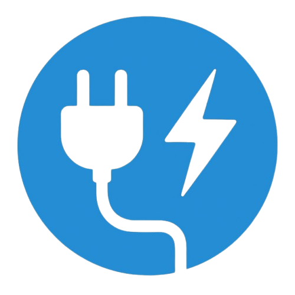

<div align="center">
  

# Svitlo Kremen Bot

A Telegram bot for tracking power outage schedules in Kremenchuk.
Automatically reads schedules from the [@mo3ambik_gpv_1_2](https://t.me/mo3ambik_gpv_1_2) channel, recognizes them via OCR, and sends a clean text schedule to subscribers.

**[@svitlo_kremen_bot](https://t.me/svitlo_kremen_bot)**

</div>

## Features

### Automatic schedule monitoring
The bot watches the channel in real time. As soon as a new schedule image appears, it recognizes it and broadcasts to all subscribers.

### Personal notifications by queue
Each subscriber selects their sub-queue (e.g. `3.2`). The bot sends only the information relevant to that queue — with a progress bar and total hours without power.

### Change tracking
If an updated schedule is published during the day, the bot shows exactly what changed:

```
📋 Зміни:
❌ Черга 1.1: прибрали 16:00–18:00
⏱ Черга 2.2: скоротили (було 11:30–13:00 → стало 11:30–12:30)
➕ Черга 5.1: додали 22:00–23:30
```

### Current schedule and tomorrow's schedule
Users can request today's or tomorrow's schedule at any time (if already published).

### What's the status right now?
The bot answers in real time: is there power or not, how long until the next outage or restoration.

```
💡 Зараз є світло · черга 3.2
до 14:30 (ще 1 год 20 хв)
Далі: відключення 14:30 – 16:00
```

### Statistics
View outage hours for the last 7 or 30 days for your queue.

```
📊 Статистика за 7 днів — черга 3.2

10.04.2026  🟥🟥🟥🟩🟩🟩🟩🟩🟩🟩🟩🟩  6.0 год
09.04.2026  🟥🟥🟩🟩🟩🟩🟩🟩🟩🟩🟩🟩  4.0 год

Середнє: 5.0 год/день
```

## Schedule format

```
⚡ Графік відключень на 10.04.2026 (станом на 20:00)

🟡🟡🟡🟡 1 черга 🟡🟡🟡🟡
    1.1          1.2
00:00–02:30  00:30–03:00
07:00–09:30  07:30–10:00
13:00–14:30  13:30–15:00
19:00–20:30  19:30–20:30

🟢🟢🟢🟢 2 черга 🟢🟢🟢🟢
    2.1          2.2
02:00–03:30  02:30–04:00
08:00–10:30  08:30–11:00
...
```

## Tech stack

- Python 3.12
- OpenCV + Tesseract OCR
- Telethon (channel monitoring)
- Telegram Bot API
