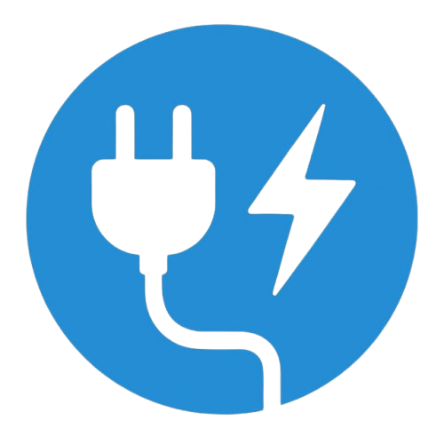

<div align="center">
  

# Svitlo Kremen Bot

A Telegram bot for tracking power outage schedules in Kremenchuk.
Automatically reads schedules from the [@mo3ambik_gpv_1_2](https://t.me/mo3ambik_gpv_1_2) channel, recognizes them via OCR, and sends a clean text schedule to subscribers.

**[@svitlo_kremen_bot](https://t.me/svitlo_kremen_bot)**

</div>

## Features

### Automatic schedule monitoring
The bot watches the channel in real time. As soon as a new schedule image appears, it recognizes it and broadcasts to all subscribers.

### Personal notifications by queue
Each subscriber selects their sub-queue (e.g. `3.2`). The bot sends only the information relevant to that queue — with a progress bar and total hours without power.

### Change tracking
If an updated schedule is published during the day, the bot shows exactly what changed:

```
📋 Зміни:
❌ Черга 1.1: прибрали 16:00–18:00
⏱ Черга 2.2: скоротили (було 11:30–13:00 → стало 11:30–12:30)
➕ Черга 5.1: додали 22:00–23:30
```

### Current schedule and tomorrow's schedule
Users can request today's or tomorrow's schedule at any time (if already published).

### What's the status right now?
The bot answers in real time (with a themed picture): is there power or not, how long until the next outage or restoration.

```
💡 Зараз є світло · черга 3.2
до 14:30 (ще 1 год 20 хв)
Далі: відключення 14:30 – 16:00
```

### Find your queue by address
Don't know your queue? The bot resolves it from your address: pick a city or type your village, then type your street — search is typo-tolerant. If a street is split between queues, the bot shows each queue's house numbers so you pick your own. One more tap subscribes you to notifications for that queue.

```
🔍 Яка у мене черга?
📍 м. Кременчук  →  вул. Лесі Українки
🟤 Ваша черга: 5.2
[✅ Отримувати сповіщення для 5.2]
```

Covers the whole Kremenchuk branch: Kremenchuk, Horishni Plavni, Kobeliaky, Hlobyne and ~200 villages (many resolve instantly — the entire settlement is in one queue).

### Statistics
View outage hours for the last 7 or 30 days for your queue.

```
📊 Статистика за 7 днів — черга 3.2

10.04.2026  🟥🟥🟥🟩🟩🟩🟩🟩🟩🟩🟩🟩  6.0 год
09.04.2026  🟥🟥🟩🟩🟩🟩🟩🟩🟩🟩🟩🟩  4.0 год

Середнє: 5.0 год/день
```

## Schedule format

Full schedule (no queue filter):

```
⚡ Графік відключень на 10.04.2026 (станом на 20:00)

🟡 1 черга
  1.1 · 00:00–02:30, 07:00–09:30, 13:00–14:30
  1.2 · 00:30–03:00, 07:30–10:00, 13:30–15:00
🟢 2 черга
  2.1 · 02:00–03:30, 08:00–10:30
  2.2 · 02:30–04:00, 08:30–11:00
...
```

Personal schedule (queue selected) adds a day summary:

```
🟡 1 черга
  1.2 · 17:00–18:00

🟥🟩🟩🟩🟩🟩🟩🟩🟩🟩🟩🟩

🕯️ 1.0 год без світла
💡 23.0 год зі світлом
```

## Tech stack

- Python 3.12
- OpenCV + Tesseract OCR
- Telethon (channel monitoring)
- Telegram Bot API
